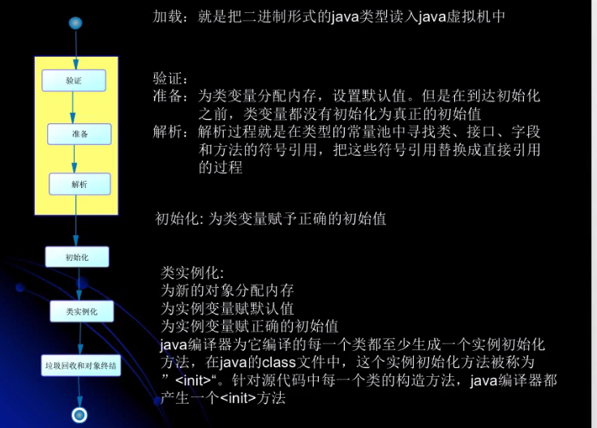

# JVM类加载器学习

### 在以下几种情况下：

- 执行了System。exit()方法
- 程序正常执行结束
- 程序在执行过程中遇到了异常或者错误而异常终止
- 由于操作系统出现错误而导致Java虚拟机进程终止

### 类的加载执行与初始化

- 加载：查找并加载类的二进制数据
- 链接
  - 验证：确保被加载的类的正确性
  - 准备：为类的静态变量分配内存，并将其初始化为默认值
  - 解析：把类中的符号引用转换为直接引用

- 初始化：为类的静态变量赋予正确的初始值

- 值得注意的是：准备阶段即使我们为静态变量赋值为任意的数值，但是该静态变量还是会被初始化为他的默认值，最后的初始化时才会把我们赋予的值设为该静态变量的值。

  

### Java程序对类的使用可以分为两种

1. 主动使用
   - 创建类的实例
   - 访问某个类或接口的静态变量，或者对该静态变量赋值
   - 调用该类的静态方法
   - 反射
   - 初始化一个类的子类
   - Java虚拟机启动时被标为启动类的类（Java Test）
2. 被动使用
3. 所有的Java虚拟机实现必须在每个类或接口被Java程序“首次主动使用”时才初始化他们

------


- 类的加载:指的是将类的。class文件中的二进制数据读入到内存中，将其放在运行时数据区的方法区内，然后在内存中创建一个`Java.lang.Class`对象（规范并没有说明Class对象位于哪里，HotSpot虚拟机将其放在了方法区中）用来封装类在方法区的数据结构

- 加载类的方式
  - 从本地系统中直接加载
  - 通过网络下载.class文件
  - 从zip，jar等归档文件中加载.class文件
  - 从专有数据库中提取.class文件
  - 将java源文件动态编译为.class文件（将JAVA源文件动态编译这种情况会在动态代理和web开发中jsp转换成Servlet）

### 完整加载过程

加载
连接（验证、准备、解析）
初始化
类的是例化：为新的对象分配内存，为实例变量赋默认值，为实例变量赋正确的初始值

java编译器在它编译的每一个类都至少生成一个实例化的方法，在java的class文件中，这个实例化方法被称为<init>。针对源代码中每一个类的构造方法，java编译器都会产生一个“<init>”方法。



**时序图**


### 有两种类型的类加载器

1. **Java虚拟机自带的加载器**

- **根类加载器**（Bootstrap）：该加载器没有父加载器，它负责加载虚拟机中的核心类库。根类加载器从系统属性sun.boot.class.path所指定的目录中加载类库。类加载器的实现依赖于底层操作系统，属于虚拟机的实现的一部分，它并没有集成java.lang.ClassLoader类。
- **扩展类加载器**（Extension）：它的父加载器为根类加载器。它从java.ext.dirs系统属性所指定的目录中加载类库，或者从JDK的安装目录的jre\lib\ext子目录（扩展目录）下加载类库，如果把用户创建的jar文件放在这个目录下，也会自动由扩展类加载器加载，扩展类加载器是纯java类，是java.lang.ClassLoader的子类。
- **系统应用类加载器**（AppClassLoader/System）：也称为应用类加载器，它的父加载器为扩展类加载器，它从环境变量classpath或者系统属性java.class.path所指定的目录中加载类，他是用户自定义的类加载器的默认父加载器。系统类加载器时纯java类，是java.lang.ClassLoader的子类。

1. **用户自定义的类加载器**

- java.lang.ClassLoader的子类
- 用户可以定制类的加载方式

根类加载器–>扩展类加载器–>系统应用类加载器–>自定义类加载器
类加载器并不需要等到某个类被“首次主动使用”时再加载它


JVM规范允许类加载器在预料某个类将要被使用时就预先加载它，如果在预先加载的过程中遇到了.class文件缺失或存在错误，类加载器必须在**程序首次主动**使用该类才报告错误（LinkageError错误），如果这个类没有被程序主动使用，那么类加载器就不会报告错误。

类加载器用来把类加载到java虚拟机中。从JDK1.2版本开始，类的加载过程采用父亲委托机制，这种机制能更好地保证Java平台的安全。在此委托机制中，除了java虚拟机自带的根类加载器以外，其余的类加载器都有且只有一个父加载器。当java程序请求加载器loader1加载Sample类时，loader1首先委托自己的父加载器去加载Sample类，若父加载器能加载，则有父加载器完成加载任务，否则才由加载器loader1本身加载Sample类。

类被加载后，就进入连接阶段。连接阶段就是将已经读入到内存的类的二进制数据合并到虚拟机的运行时环境中去。

- 类的连接-验证
  1）类文件的结构检查
  2）语义检查
  3）字节码验证
  4）二进制兼容性的验证
- 类的连接-准备
  在准备阶段，java虚拟机为类的静态变量分配内存，并设置默认的初始值。例如对于以下Sample类，在准备阶段，将为int类型的静态变量a分配4个字节的内存空间，并且赋予默认值0，为long类型的静态变量b分配8个字节的内存空间，并且赋予默认值0；

```java
    public class Sample{
        private static int a=1;
        public  static long b;
        public  static long c;
        static {
            b=2;
        }
    }

```

**初始化**
在初始化阶段，Java虚拟机执行类的初始化语句，为类的静态变量赋予初始值。在程序中，静态变量的初始化有两种途径：（1）在静态变量的声明处进行初始化；（2）在静态代码块中进行初始化。
**类的初始化步骤**：
（1）假如这个类还没有被加载和连接，那就先进行加载和连接
（2）假如类存在直接父类，并且这个父类还没有被初始化，那就先初始化直接父类
（3）假如类中存在初始化语句，那就依次执行这些初始化语句
当java虚拟机初始化一个类时，要求它的所有父类都已经被初始化，**但是这条规则不适用于接口**。因此，一个父接口并不会因为它的子接口或者实现类的初始化而初始化。只有当程序首次使用特定的接口的静态变量时，才会导致该接口的初始化。

```
 * Created By poplar on 2019/11/7
 * <p>
 * 当一个接口在初始化时，并不要求其父接口都完成了初始化
 * 只有在真正使用到父接口的时候（如引用接口中定义的常量），才会初始化
 * </p>
 */
public class ClassLoadTest5 {
    public static void main(String[] args) {
        System.out.println(MyChild.b);
    }

}

interface Student5 {

    int a = 9; //前面省了public static final

    Thread thread = new Thread() {
        {
            System.out.println("thread 初始化了");//如果父接口初始化了这句应该输出
        }
    };
}

interface MyChild extends Student5 {     //接口属性默认是 public static final
    String b = LocalDateTime.now().toString();
}
```

调用ClassLoader类的loadClass方法加载一个类，并不是对类的主动使用，不会导致类的初始化。

### 类加载器的(双亲委派机制)父亲委托机制

在父亲委托机制中，各个加载器按照父子关系形成了树形结构，除了根加载器之外，其余的类加载器都有一个父加载器

- 若有一个类能够成功加载Test类，那么这个类加载器被称为**定义类加载器**，所有能成功返回Class对象引用的类加载器（包括定义类加载器）称为**初始类加载器**。


### 类加载器测试7

```java
package com.poplar.classload;

/**
 * Created By poplar on 2019/11/7
 */
public class ClassLoadTest7 {
    public static void main(String[] args) {
        System.out.println(String.class.getClassLoader());//null 由于String是由根加载器加载，在rt.jar包下
        System.out.println(C.class.getClassLoader());//sun.misc.Launcher$AppClassLoader@73d16e93
    }
}

class C {

}
```

### 测试9：

```java
package com.poplar.classload;

/**
 * Created By poplar on 2019/11/7
 */
public class ClassLoadTest9 {

    static {
        System.out.println("ClassLoadTest9");
    }

    public static void main(String[] args) {
        System.out.println(Child1.a);
    }
}

class Parent1 {
    static int a = 9;

    static {
        System.out.println("Parent1");
    }
}

class Child1 extends Parent1 {
    static int b = 0;

    static {
        System.out.println("Child1");
    }
}

//最后输出顺序
//ClassLoadTest9
// Parent1
//9
```

### 测试10:

```java
package com.poplar.classload;

/**
 * Created By poplar on 2019/11/7
 */
public class ClassLoadTest10 {

    static {
        System.out.println("ClassLoadTest10");
    }

    public static void main(String[] args) {
        Parent2 parent2;
        parent2 = new Parent2();
        System.out.println(Parent2.a);
        System.out.println(Child2.b);
        /*执行结果：由于父类已经初始化过了所以Parent2只输出一次
         * ClassLoadTest10
         * Parent2
         * 2
         * Child2
         * 3
         */
    }
}

class Parent2 {
    static int a = 2;

    static {
        System.out.println("Parent2");
    }
}

class Child2 extends Parent2 {
    static int b = 3;

    static {
        System.out.println("Child2");
    }
}
```

### 测试12：

```java
package com.poplar.classload;

/**
 * Created By poplar on 2019/11/7
 * 调用类的loadClass并不是主使实用类，不会导致类的初始化
 */
public class ClassLoadTest12 {
    public static void main(String[] args) throws ClassNotFoundException {

        ClassLoader classLoader = ClassLoader.getSystemClassLoader();
        Class<?> loadClass = classLoader.loadClass("com.poplar.classload.G");
        System.out.println("-------------------------------");
        Class<?> clazz = Class.forName("com.poplar.classload.G");//反射会导致一个类的初始化
        System.out.println(clazz);
        //输出结果：
        //G
        //class com.poplar.classload.G
    }
}

class G { 1
    static {
        System.out.println("G");
    }
}
```

### 测试16:

```java
package com.poplar.classload;

import java.io.*;

/**
 * Created By poplar on 2019/11/7
 * 自定义类加载器
 */
public class CustomClassLoader extends ClassLoader {

    private String classLoaderName;
    private static final String filePost = ".class";

    public CustomClassLoader(ClassLoader parent, String classLoaderName) {
        super(parent);//显示指定该类的父类加载器
        this.classLoaderName = classLoaderName;
    }

    public CustomClassLoader(String classLoaderName) {
        super();//将系统类加载器当作该类的父类加载器
        this.classLoaderName = classLoaderName;
    }

    @Override
    public Class findClass(String name) {
    	System.out.println("findClass,输出这句话说明我们自己的类加载器加载了指定的类");
        byte[] b = loadClassData(name);
        return defineClass(name, b, 0, b.length);
    }

    private byte[] loadClassData(String name) {
        InputStream is = null;
        byte[] data = null;
        ByteArrayOutputStream byteArrayOutputStream = null;

        try {
            name = name.replace(".", File.separator);//File.separator根据操作系统而变化
            is = new FileInputStream(new File(name + filePost));
            byteArrayOutputStream = new ByteArrayOutputStream();
            int len = 0;
            while (-1 != (len = is.read())) {
                byteArrayOutputStream.write(len);
            }
            data = byteArrayOutputStream.toByteArray();

        } catch (Exception e) {
            e.printStackTrace();
        } finally {
            try {
                is.close();
                byteArrayOutputStream.close();
            } catch (IOException e) {
                e.printStackTrace();
            }
            return data;
        }
    }

    public static void test(ClassLoader classLoader) throws Exception {
        Class<?> clazz = classLoader.loadClass("com.poplar.classload.ClassLoadTest");
        Object instance = clazz.newInstance();
        System.out.println(instance);
    }

    public static void main(String[] args) throws Exception {
        CustomClassLoader classLoader = new CustomClassLoader("load1");
        test(classLoader);
    }
}
//这个列子中最后的类加载器是系统类加载器，而非我们自己的类加载器，是因为我们要加载的类刚好在系统类加载器的加载范围
```

### 测试16改进：

```java
package com.poplar.classload;

import java.io.*;

/**
 * Created By poplar on 2019/11/7
 * 自定义类加载器
 */
public class CustomClassLoader2 extends ClassLoader {

    private String classLoaderName;

    private String path;

    public void setPath(String path) {
        this.path = path;
    }

    private static final String filePost = ".class";

    public CustomClassLoader2(ClassLoader parent, String classLoaderName) {
        super(parent);//显示指定该类的父类加载器
        this.classLoaderName = classLoaderName;
    }

    public CustomClassLoader2(String classLoaderName) {
        super();//将系统类加载器当作该类的父类加载器
        this.classLoaderName = classLoaderName;
    }

    @Override
    public Class findClass(String name) {
        System.out.println("findClass,输出这句话说明我们自己的类加载器加载了指定的类");
        byte[] b = loadClassData(name);
        return defineClass(name, b, 0, b.length);
    }

    private byte[] loadClassData(String name) {
        InputStream is = null;
        byte[] data = null;
        ByteArrayOutputStream byteArrayOutputStream = null;

        try {
            name = name.replace(".", File.separator);//File.separator根据操作系统而变化
            is = new FileInputStream(new File(path + name + filePost));
            byteArrayOutputStream = new ByteArrayOutputStream();
            int len = 0;
            while (-1 != (len = is.read())) {
                byteArrayOutputStream.write(len);
            }
            data = byteArrayOutputStream.toByteArray();

        } catch (Exception e) {
            e.printStackTrace();
        } finally {
            try {
                is.close();
                byteArrayOutputStream.close();
            } catch (IOException e) {
                e.printStackTrace();
            }
            return data;
        }
    }


    public static void main(String[] args) throws Exception {
        
        CustomClassLoader2 Loader2 = new CustomClassLoader2("load2");
  		test1(loader2) 
        CustomClassLoader2 Loader3 = new CustomClassLoader2("load3");
  		test1(loader3)    
     /*
        执行结果： 
        findClass,输出这句话说明我们自己的类加载器加载了指定的类
        com.poplar.classload.CustomClassLoader2@15db9742
        2018699554
        -------------------------------------
        findClass,输出这句话说明我们自己的类加载器加载了指定的类
        com.poplar.classload.CustomClassLoader2@4e25154f
        1550089733*/
     
    }
  private static void test1(CustomClassLoader2 loader2) throws ClassNotFoundException, InstantiationException, IllegalAccessException {
        loader2.setPath("C:\\Users\\poplar\\Desktop\\");
        Class<?> clazz = loader2.loadClass("com.poplar.classload.ClassLoadTest");
        Object instance = clazz.newInstance();
        System.out.println(instance.getClass().getClassLoader());
        System.out.println(instance.hashCode());
        System.out.println("-------------------------------------");
        //运行结果：（此处测试建议把源码文件先删掉，不然idea会重新生成classes,还是会导致系统类加载器加载）
}

```

### 命名空间(上面的列子中加载同一个文件)

- 每个类加载器都有自己的命名空间，**命名空间由该加载器及所有父加载器所加载的类构成**；
- 在同一个命名空间中，不会出现类的完整名字（包括类的包名）相同的两个类；
- 在不同的命名空间中，有可能会出现类的完整名字（包括类的包名）相同的两个类；
- 同一命名空间内的类是互相可见的，**非同一命名空间内的类是不可见的**；
- 子加载器可以见到父加载器加载的类，**父加载器也不能见到子加载器加载的类**。

### 类的卸载

- 当一个类被加载、连接和初始化之后，它的生命周期就开始了。当此类的Class对象不再被引用，即不可触及时，Class对象就会结束生命周期，类在方法区内的数据也会被卸载。
- 一个类何时结束生命周期，取决于代表它的Class对象何时结束生命周期。
- 由Java虚拟机自带的类加载器所加载的类，在虚拟机的生命周期中，始终不会被卸载。Java虚拟机本身会始终引用这些加载器，而这些类加载器则会始终引用他们所加载的类的Class对象，因此这些Class对象是可触及的。
- 由用户自定义的类加载器所加载的类是可以被卸载的。（**jvisualvm 查看当前java进程 -XX:+TraceClassUnloading这个用于追**）

```java
  public static void main(String[] args) throws Exception {
        CustomClassLoader2 Loader2 = new CustomClassLoader2("load2");
        test1(Loader2);
        Loader2 = null;
        System.gc();
        Thread.sleep(10000); //jvisualvm 查看当前java进程 -XX:+TraceClassUnloading这个用于追踪类卸载的信息
        CustomClassLoader2 Loader3 = new CustomClassLoader2("load2");
        test1(Loader3);
        /*
        执行结果：
        findClass,输出这句话说明我们自己的类加载器加载了指定的类
        com.poplar.classload.CustomClassLoader2@15db9742
        2018699554
        -------------------------------------
        [Unloading class com.poplar.classload.ClassLoadTest 0x0000000100060828]
        findClass,输出这句话说明我们自己的类加载器加载了指定的类
        com.poplar.classload.CustomClassLoader2@4e25154f
        1550089733*/
    }
```

### 测试17：

```java
package com.poplar.classload;

/**
 * Created By poplar on 2019/11/8
 */
public class MyCat {
    public MyCat() {
        System.out.println("MyCat by load " + MyCat.class.getClassLoader());
    }
}


/**
 * Created By poplar on 2019/11/8
 */
public class Simple {
    public Simple() {
        System.out.println("Simple by Load " + Simple.class.getClassLoader());
        new MyCat();
    }
}


/**
 * Created By poplar on 2019/11/8
 */
public class ClassLoadTest17 {
    public static void main(String[] args) throws Exception {
        CustomClassLoader2 loader = new CustomClassLoader2("loader");
        Class<?> clazz = loader.loadClass("com.poplar.classload.Simple");
        System.out.println(clazz.hashCode());
        //如果注释掉该行，就并不会实例化MySample对象，不会加载MyCat（可能预先加载）
        Object instance = clazz.newInstance();//实列化Simple和MyCat
    }
}
```

**测试17-1**:

```java
public class ClassLoadTest17_1 {
    public static void main(String[] args) throws Exception {
        CustomClassLoader2 loader = new CustomClassLoader2("loader");
        loader.setPath("C:\\Users\\poplar\\Desktop\\");
        Class<?> clazz = loader.loadClass("com.poplar.classload.Simple");
        System.out.println(clazz.hashCode());
        //如果注释掉该行，就并不会实例化MySample对象，不会加载MyCat（可能预先加载）
        Object instance = clazz.newInstance();//实列化Simple和MyCat
        //MyCat是由加载MySample的加载器去加载的：
        //如果只删除classpath下的MyCat，则会报错，NoClassDefFoundError；
        //如果只删除classpath下的MySample，则由自定义加载器加载桌面上的MySample，由系统应用加载器加载MyCat。
    }
}
```


### 测试17_2

```java
package com.poplar.classload;

/**
 * Created By poplar on 2019/11/8
 */
public class ClassLoadTest17_2 {
    public static void main(String[] args) throws Exception {
        CustomClassLoader2 loader = new CustomClassLoader2("loader");
        loader.setPath("C:\\Users\\poplar\\Desktop\\");
        Class<?> clazz = loader.loadClass("com.poplar.classload.Simple2");
        System.out.println(clazz.hashCode());
        //如果注释掉该行，就并不会实例化MySample对象，不会加载MyCat（可能预先加载）
        Object instance = clazz.newInstance();//实列化Simple和MyCat
        //修改MyCat2后，仍然删除classpath下的Simple2，留下MyCat2，程序报错
        //因为命名空间，父加载器找不到子加载器所加载的类，因此MyCat2找不到
    }
}

class MyCat2 {
    public MyCat2() {
        System.out.println("MyCat by load " + MyCat.class.getClassLoader());
        System.out.println(Simple.class);
    }
}

class Simple2 {
    public Simple2() {
        System.out.println("Simple by Load " + Simple.class.getClassLoader());
        new MyCat();
        System.out.println(MyCat.class);
    }
}
```

1. **子加载器所加载的类能够访问父加载器所加载的类；**
2. **而父加载器所加载的类无法访问子加载器所加载的类**。

### 测试18:

```java
package com.poplar.classload;

/**
 * Created By poplar on 2019/11/8
 */
public class ClassLoadTest18 {
    public static void main(String[] args) {
        System.out.println(System.getProperty("sun.boot.class.path"));//根加载器路径
        System.out.println(System.getProperty("java.ext.dirs"));//扩展类加载器路径
        System.out.println(System.getProperty("java.class.path"));//应用类加载器路径
    }
}

```

### 测试19:

```java
/**
 * Created By poplar on 2019/11/8
 * 各加载器的路径是可以修改的，修改后会导致运行失败，ClassNotFoundExeception
 */
public class ClassLoadTest19 {
    public static void main(String[] args) {
        //该类默认有扩展类加载器加载的,但是如果我们把该类默认的加载路劲修改后，就会报错
        AESKeyGenerator aesKeyGenerator = new AESKeyGenerator();
        System.out.println(aesKeyGenerator.getClass().getClassLoader()); //ExtClassLoader@232204a1
    }
}

```

### 测试20

```java
package com.poplar.classload;

import java.lang.reflect.Method;

/**
 * Created By poplar on 2019/11/8
 */
public class ClassLoadTest20 {
    public static void main(String[] args) throws Exception {
        CustomClassLoader2 loader1 = new CustomClassLoader2("load1");
        CustomClassLoader2 loader2 = new CustomClassLoader2("load2");
        Class<?> clazz1 = loader1.loadClass("com.poplar.classload.Person");
        Class<?> clazz2 = loader2.loadClass("com.poplar.classload.Person");

        //clazz1和clazz均由应用类加载器加载的，第二次不会重新加载，结果为true
        System.out.println(clazz1 == clazz2);

        Object object1 = clazz1.newInstance();
        Object object2 = clazz2.newInstance();

        Method method = clazz1.getMethod("setPerson", Object.class);
        method.invoke(object1, object2);
    }
}

class Person {

    private Person person;

    public void setPerson(Object object) {
        this.person = (Person) object;
    }
}
```

 ### 测试21：

```java
package com.poplar.classload;

import java.lang.reflect.Method;

/**
 * Created By poplar on 2019/11/8
 * 1.每个类加载器都有自己的命名空间，命名空间由该加载器及所有父加载器所加载的类构成；
 * 2.在同一个命名空间中，不会出现类的完整名字（包括类的包名）相同的两个类；
 * 3.在不同的命名空间中，有可能会出现类的完整名字（包括类的包名）相同的两个类；
 * 4.同一命名空间内的类是互相可见的，非同一命名空间内的类是不可见的；
 * 5.子加载器可以见到父加载器加载的类，父加载器也不能见到子加载器加载的类。
 */
public class ClassLoadTest21 {

    public static void main(String[] args) throws Exception {
        CustomClassLoader2 loader1 = new CustomClassLoader2("load1");
        loader1.setPath("C:\\Users\\poplar\\Desktop\\");
        CustomClassLoader2 loader2 = new CustomClassLoader2("load2");
        loader2.setPath("C:\\Users\\poplar\\Desktop\\");
        Class<?> clazz1 = loader1.loadClass("com.poplar.classload.MyPerson");
        Class<?> clazz2 = loader2.loadClass("com.poplar.classload.MyPerson");
        //由于clazz1和clazz2分别有不同的类加载器所加载，所以他们处于不同的名称空间里
        System.out.println(clazz1 == clazz2);//false

        Object object1 = clazz1.newInstance();
        Object object2 = clazz2.newInstance();

        Method method = clazz1.getMethod("setMyPerson", Object.class);
        //此处报错，loader1和loader2所处不用的命名空间
        method.invoke(object1, object2);
       /* 
       	 
       	findClass,输出这句话说明我们自己的类加载器加载了指定的类
        findClass,输出这句话说明我们自己的类加载器加载了指定的类
        false
        Exception in thread "main" java.lang.reflect.InvocationTargetException
        at sun.reflect.NativeMethodAccessorImpl.invoke0(Native Method)
        at sun.reflect.NativeMethodAccessorImpl.invoke(NativeMethodAccessorImpl.java:62)
        at sun.reflect.DelegatingMethodAccessorImpl.invoke(DelegatingMethodAccessorImpl.java:43)
        at java.lang.reflect.Method.invoke(Method.java:498)
        at com.poplar.classload.ClassLoadTest21.main(ClassLoadTest21.java:25)
        Caused by: java.lang.ClassCastException: com.poplar.classload.MyPerson cannot be cast to com.poplar.classload.MyPerson*/
    }
}

/**
 * Created By poplar on 2019/11/8
 */
public class MyPerson {

    private MyPerson person;

    public void setMyPerson(Object object) {
        this.person = (MyPerson) object;
    }
}

```

- 类加载器双亲委托模型的好处：
  （1）可以确保Java和核心库的安全：所有的Java应用都会引用java.lang中的类，也就是说在运行期java.lang中的类会被加载到虚拟机中，如果这个加载过程如果是由自己的类加载器所加载，那么很可能就会在JVM中存在多个版本的java.lang中的类，而且这些类是相互不可见的（命名空间的作用）。借助于双亲委托机制，Java核心类库中的类的加载工作都是由启动根加载器去加载，从而确保了Java应用所使用的的都是同一个版本的Java核心类库，他们之间是相互兼容的；
  （2）确保Java核心类库中的类不会被自定义的类所替代；
  （3）不同的类加载器可以为相同名称的类（binary name）创建额外的命名空间。相同名称的类可以并存在Java虚拟机中，只需要用不同的类加载器去加载即可。相当于在Java虚拟机内部建立了一个又一个相互隔离的Java类空间。
- 父亲委托机制的优点是能够提高软件系统的安全性。因此在此机制下，用户自定义的类加载器不可能加载应该由父类加载器加载的可靠类，从而防止不可靠甚至恶意的代码代替由父类加载器加载的可靠代码。例如，java.lang.Object类是由跟类加载器加载，其他任何用哪个户自定义的类加载器都不可能加载含有恶意代码的java.lang.Object类。

### 测试22:

```java
package com.poplar.classload;

/**
 * Created By poplar on 2019/11/8
 */
public class ClassLoadTest22 {

    static {
        System.out.println("ClassLoadTest22 invoked");
    }

    //扩展类加载器只加载jar包，需要把class文件打成jar
    //此列子中将扩展类加载的位置改成了当前的classes目录
    public static void main(String[] args) {
        System.out.println(ClassLoadTest22.class.getClassLoader());
        System.out.println(ClassLoadTest2.class.getClassLoader());
    }
}

```

### 测试23：

```java
package com.poplar.classload;

import sun.misc.Launcher;

/**
 * Created By poplar on 2019/11/8
 * 在运行期，一个Java类是由该类的完全限定名（binary name）和用于加载该类的定义类加载器所共同决定的。
 * 如果同样名字（完全相同限定名）是由两个不同的加载器所加载，那么这些类就是不同的，即便.class文件字节码相同，并且从相同的位置加载亦如此。
 * 在oracle的hotspot，系统属性sun.boot.class.path如果修改错了，则运行会出错：
 * Error occurred during initialization of VM
 * java/lang/NoClassDeFoundError: java/lang/Object
 */
public class ClassLoadTest23 {
    public static void main(String[] args) {
        System.out.println(System.getProperty("sun.boot.class.path"));//根加载器路径
        System.out.println(System.getProperty("java.ext.dirs"));//扩展类加载器路径
        System.out.println(System.getProperty("java.class.path"));//应用类加载器路径

        System.out.println(ClassLoader.class.getClassLoader());
        //此处由于系统和扩展类加载器都是Launcher其内部静态类，但又都是非public的，
        //所以不能直接获取他们的类加载器，方法就是通过获取他们的外部类加载器是谁？从而确当他们的类加载器。
        System.out.println(Launcher.class.getClassLoader());

        //下面的系统属性指定系统类加载器，默认是AppClassLoader
        System.out.println(System.getProperty("java.system.class.loader"));
    }
}

```

- 类加载器本身也是类加载器，类加载器又是谁加载的呢？？（先有鸡还是现有蛋）
  类加载器是由启动类加载器去加载的，启动类加载器是C++写的，内嵌在JVM中。
- 内嵌于JVM中的启动类加载器会加载java.lang.ClassLoader以及其他的Java平台类。当JVM启动时，一块特殊的机器码会运行，它会加载扩展类加载器以及系统类加载器，这块特殊的机器码叫做启动类加载器。
- 启动类加载器并不是java类，其他的加载器都是java类。
- 启动类加载器是特定于平台的机器指令，它负责开启整个加载过程。

### 测试24：

```java
package com.poplar.classload;

/**
 * Created By poplar on 2019/11/9
 */
public class ClassLoadTest24 {

    /**
     * 当前类加载器(Current ClassLoader)
     * 每个类都会尝试使用自己的类加载器去加载依赖的类。
     * <p>
     * 线程上下文类加载器(Context ClassLoader)
     * 线程上下文加载器 @ jdk1.2
     * 线程类中的 getContextClassLoader() 与 setContextClassLoader(ClassLoader c)
     * 如果没有通过setContextClassLoader()方法设置，线程将继承父线程的上下文类加载器，
     * java应用运行时的初始线程的上下文类加载器是系统类加载器。该线程中运行的代码可以通过该类加载器加载类和资源。
     * <p>
     * 线程上下文类加载器的作用：
     * SPI：Service Provide Interface
     * 父ClassLoader可以使用当前线程Thread.currentThread().getContextClassLoader()所制定的ClassLoader加载的类，
     * 这就改变了父加载器加载的类无法使用子加载器或是其他没有父子关系的ClassLoader加载的类的情况，即改变了双亲委托模型。
     * <p>
     * 在双亲委托模型下，类加载是由下至上的，即下层的类加载器会委托父加载器进行加载。但是对于SPI来说，
     * 有些接口是Java核心库所提供的的（如JDBC），Java核心库是由启动类记载器去加载的，而这些接口的实现却来自不同的jar包（厂商提供），
     * Java的启动类加载器是不会加载其他来源的jar包，这样传统的双亲委托模型就无法满足SPI的要求。通过给当前线程设置上下文类加载器，
     * 就可以由设置的上下文类加载器来实现对于接口实现类的加载。
     */
    public static void main(String[] args) {
        System.out.println(Thread.currentThread().getContextClassLoader());
        System.out.println(Thread.class.getClassLoader());
    }
}

```

### 线程上下文类加载器

- **当前类加载器(Current ClassLoader)**
  每个类都会尝试使用自己的类加载器去加载依赖的类。


- **线程上下文类加载器(Context ClassLoader)**
  线程上下文加载器 @ jdk1.2
  线程类中的` getContextClassLoader() `与 `setContextClassLoader(ClassLoader c)`
  如果没有通过`setContextClassLoader()`方法设置，线程将继承父线程的上下文类加载器，
  java应用运行时的初始线程的上下文类加载器是系统类加载器。该线程中运行的代码可以通过该类加载器加载类和资源。

- **线程上下文类加载器的作用：**
  **SPI**：`Service Provide Interface`
  父`ClassLoader`可以使用当前线程`Thread.currentThread().getContextClassLoader()`所制定的`ClassLoader`加载的类，
  这就改变了父加载器加载的类无法使用子加载器或是其他没有父子关系的`ClassLoader`加载的类的情况，即改变了双亲委托模型。

- **在双亲委托模型下**，类加载是由下至上的，即下层的类加载器会委托父加载器进行加载。但是对于SPI来说，
  有些接口是Java核心库所提供的的（如JDBC），Java核心库（如Connection接口）是由启动类加载器去加载的，而这些接口的实现却来自不同的jar包（**默认会被添加到classes下，这样就会导致父加载器无法访问子类加载器所加载的类**）（厂商提供），
  Java的启动类加载器是不会加载其他来源的jar包，这样传统的双亲委托模型就无法满足SPI的要求。通过给当前线程设置上下文类加载器，
  就可以由设置的上下文类加载器来实现对于接口实现类的加载。

### 测试25:

```java
package com.poplar.classload;

/**
 * Created By poplar on 2019/11/9
 */
public class ClassLoadTest25 implements Runnable {

    private Thread thread;

    public ClassLoadTest25() {
        thread = new Thread(this);
        thread.start();
    }

    @Override
    public void run() {
        ClassLoader classLoader = thread.getContextClassLoader();
        thread.setContextClassLoader(classLoader);
        System.out.println("Class: " + classLoader.getClass()); //Class: class sun.misc.Launcher$AppClassLoader
        System.out.println("Parent " + classLoader.getParent()); // Parent sun.misc.Launcher$ExtClassLoader@5b74b597
    }

    public static void main(String[] args) {
        new ClassLoadTest25();
    }
}
//源码：
   /* public Launcher() {
        Launcher.ExtClassLoader var1;
        try {
            var1 = Launcher.ExtClassLoader.getExtClassLoader();
        } catch (IOException var10) {
            throw new InternalError("Could not create extension class loader", var10);
        }

        try {
            //获取到系统类加载器
            this.loader = Launcher.AppClassLoader.getAppClassLoader(var1);
        } catch (IOException var9) {
            throw new InternalError("Could not create application class loader", var9);
        }
        //把系统类加载器设置到当前线程的上下文类加载器中
        Thread.currentThread().setContextClassLoader(this.loader);
    }*/
```

### 测试26

```java
package com.poplar.classload;

import java.sql.Driver;
import java.util.Iterator;
import java.util.ServiceLoader;

/**
 * Created By poplar on 2019/11/9
 * <p>
 * 线程上下文类加载器的一般使用模式：（获取-使用-还原）
 * 伪代码：
 * ClassLoader classLoader=Thread.currentThread().getContextLoader();
 * try{
 * Thread.currentThread().setContextLoader(targetTccl);
 * myMethod();
 * }finally{
 * Thread.currentThread().setContextLoader(classLoader);
 * }
 * 在myMethod中调用Thread.currentThread().getContextLoader()做某些事情
 * ContextClassLoader的目的就是为了破坏类加载委托机制
 * <p>
 * 在SPI接口的代码中，使用线程上下文类加载器就可以成功的加载到SPI的实现类。
 * <p>
 * 当高层提供了统一的接口让底层去实现，同时又要在高层加载（或实例化）底层的类时，
 * 就必须通过上下文类加载器来帮助高层的ClassLoader找到并加载该类。
 */
public class ClassLoadTest26 {
    public static void main(String[] args) {

        //一旦加入下面此行，将使用ExtClassLoader去加载Driver.class， ExtClassLoader不会去加载classpath，因此无法找到MySql的相关驱动。
        //Thread.getCurrentThread().setContextClassLoader(MyTest26.class.getClassLoader().parent());

        //ServiceLoader服务提供者，加载实现的服务
        ServiceLoader<Driver> loader = ServiceLoader.load(Driver.class);
        Iterator<Driver> iterator = loader.iterator();
        while (iterator.hasNext()) {
            Driver driver = iterator.next();
            System.out.println("driver:" + driver.getClass() + ",loader" + driver.getClass().getClassLoader());
        }
        System.out.println("当前上下文加载器" + Thread.currentThread().getContextClassLoader());
        System.out.println("ServiceLoader的加载器" + ServiceLoader.class.getClassLoader());
    }
}


```

### 测试27

```java
package com.poplar.classload;

import java.sql.Connection;
import java.sql.DriverManager;

/**
 * Created By poplar on 2019/11/9
 */
public class ClassLoadTest27 {
    //源码：DriverManager.getConnection(){}方法中的：
    /* private static boolean isDriverAllowed(Driver driver, ClassLoader classLoader) {
            boolean result = false;
            if(driver != null) {
                Class<?> aClass = null;
                try {
                    //到这儿时其实已经加载过了，再次加载主要是名称空间的问题，确保是在同一名称空间下
                    aClass =  Class.forName(driver.getClass().getName(), true, classLoader);
                } catch (Exception ex) {
                    result = false;
                }
                result = ( aClass == driver.getClass() ) ? true : false;
            }

            return result;
        }*/
    public static void main(String[] args) throws Exception {
        Class<?> clazz = Class.forName("com.mysql.jdbc.Driver");
        Connection connection = DriverManager.getConnection("jdbc:mysql://localhost:3306/user", "root", "123456");
    }
}

```

### jar hell问题以及解决办法

```
/* 
 当一个类或者一个资源文件存在多个jar中，就会存在jar hell问题。
 可通过以下代码解决问题：*/
 ClassLoader classLoader = Thread.currentThread().getContextClassLoader();
 String resource = "java/lang/String.class";
 Enumeration<URL> urls = classLoader.getResources(resource);
 while (urls.hasMoreElements()) {
     URL element = urls.nextElement();
     System.out.println(element);
 }
```