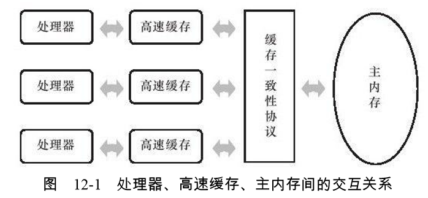
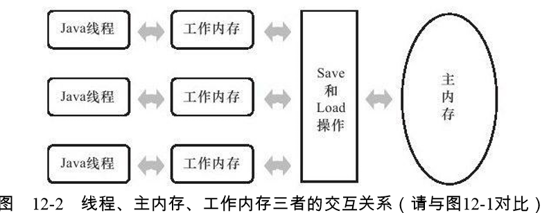
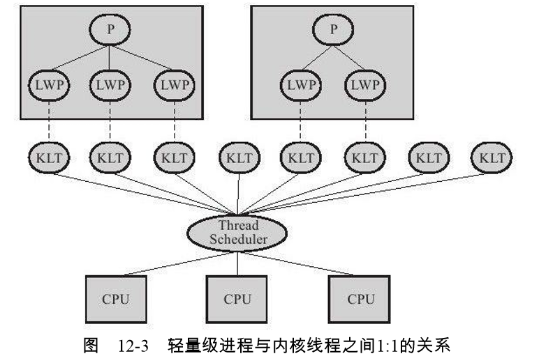
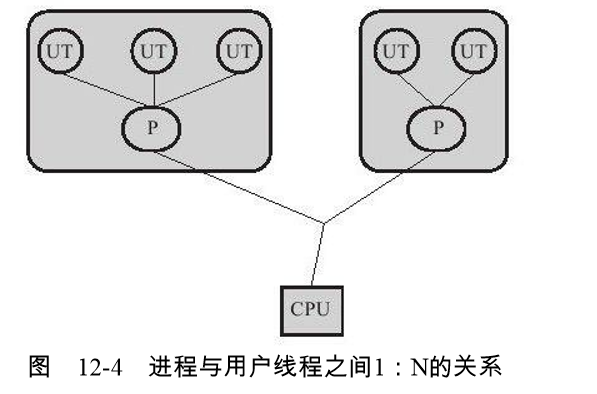
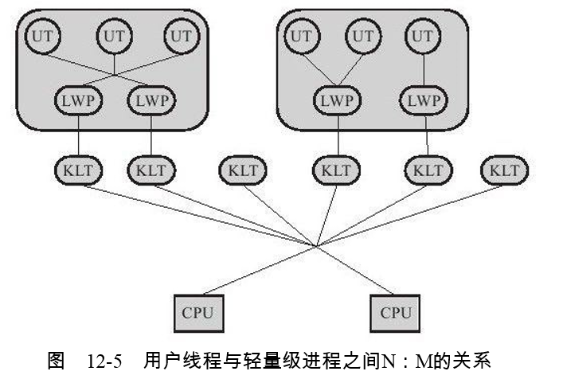
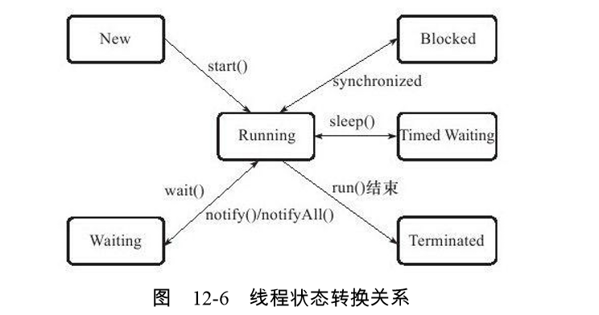

### JMM

### 计算机物理内存模型



### java JMM


- Java内存模型规定了所有的变量都存储在主内存（Main Memory）中（此处的主内存与 介绍物理硬件时的主内存名字一样，两者也可以互相类比，但此处仅是虚拟机内存的一部 分）。每条线程还有自己的工作内存（Working Memory，可与前面讲的处理器高速缓存类 比），线程的工作内存中保存了被该线程使用到的变量的主内存副本拷贝。
- 线程对变量的 所有操作（读取、赋值等）都必须在工作内存中进行，而不能直接读写主内存中的变量。 不同的线程之间也无法直接访问对方工作内存中的变量，线程间变量值的传递均需要通过主 内存来完成

### 内存间交互操作 

- 关于主内存与工作内存之间具体的交互协议，即一个变量如何从主内存拷贝到工作内 存、如何从工作内存同步回主内存之类的实现细节，Java内存模型中定义了以下8种操作来 完成，虚拟机实现时必须保证下面提及的每一种操作都是原子的
  - lock（锁定）：作用于主内存的变量，它把一个变量标识为一条线程独占的状态。 
  - unlock（解锁）：作用于主内存的变量，它把一个处于锁定状态的变量释放出来，释放 后的变量才可以被其他线程锁定。
  -  read（读取）：作用于主内存的变量，它把一个变量的值从主内存传输到线程的工作内 存中，以便随后的load动作使用。 
  - load（载入）：作用于工作内存的变量，它把read操作从主内存中得到的变量值放入工 作内存的变量副本中。 
  - use（使用）：作用于工作内存的变量，它把工作内存中一个变量的值传递给执行引 擎，每当虚拟机遇到一个需要使用到变量的值的字节码指令时将会执行这个操作。
  -  assign（赋值）：作用于工作内存的变量，它把一个从执行引擎接收到的值赋给工作内 存的变量，每当虚拟机遇到一个给变量赋值的字节码指令时执行这个操作。
  -  store（存储）：作用于工作内存的变量，它把工作内存中一个变量的值传送到主内存 中，以便随后的write操作使用。
  -  write（写入）：作用于主内存的变量，它把store操作从工作内存中得到的变量的值放入 主内存的变量中

### 对于volatile型变量的特殊规则 

- 关键字volatile可以说是Java虚拟机提供的最轻量级的同步机制，

  - 是保证此变量对所有线程的可 见性，这里的“可见性”是指当一条线程修改了这个变量的值，新值对于其他线程来说是可以 立即得知的

    - 是Java里面的运算并非 原子操作，导致volatile变量的运算在并发下一样是不安全的

       ```java
       /**
       ```
     * Created BY poplar ON 2019/12/7
     * volatile在并发环境下并非原子操作
       */
       public class VolatileTest {

       public static volatile int race = 0;

       public static void increase() {
           race++;
       }

       public static final int THREAD_COUNT = 20;

       public static void main(String[] args) {
           for (int i = 0; i < THREAD_COUNT; i++) {
               new Thread(() -> {
                   for (int j = 0; j < 10000; j++) {
                       increase();
                   }
               }).start();
           }

           //等待所有累加线程都结束,如果还有线程在运行，主线程就让出cpu资源
           while (Thread.activeCount() > 2) {//由于idea原因此处不能为一
               Thread.yield();
           }
           System.out.println(race);
       }

       /*
       public static void increase();
       descriptor: ()V
       flags: ACC_PUBLIC, ACC_STATIC
       Code:
         stack=2, locals=0, args_size=0
            0: getstatic     #2                  // Field race:I
            3: iconst_1
            4: iadd
            5: putstatic     #2                  // Field race:I
            8: return
            当getstatic指令把race的值取到操作栈顶时，volatile关键字保证了race的值在此 时是正确的，但是在执行iconst_1、iadd这些指令的时候，
            其他线程可能已经把race的值加大 了，而在操作栈顶的值就变成了过期的数据，所以putstatic指令执行后就可能把较小的race值 同步回主内存之中
       */
       }

       ```
       
       ```

    

  - 禁止指令重排序优化

    ```java
    /**
     * Created BY poplar ON 2019/12/8
     * volatile静止指令重排序演示代码
     */
    public class Singleton {
    
        private volatile static Singleton instance;
    
        private Singleton() {
        }
    
        public static Singleton getInstance() {
            if (instance == null) {
                synchronized (Singleton.class) {
                    if (instance == null) {
                        instance = new Singleton();
                    }
                }
            }
            return instance;
        }
    
        public static void main(String[] args) {
            Singleton.getInstance();
        }
    }
    /*
    instance = new Singleton();
    这段代码可以分为如下的三个步骤：
    memory = allocate();  // 1：分配对象的内存空间
    ctorInstance(memory); // 2：初始化对象
    instance = memory;    // 3：设置instance指向刚分配的内存地址
    我们知道，编辑器和处理器会进行代码优化，而其中重要的一点是会将指令进行重排序。
    上边的代码经过重排序后可能会变为：
    memory = allocate();  // 1：分配对象的内存空间
    instance = memory;    // 3：设置instance指向刚分配的内存地址
    					  // 注意：此时对象尚未初始化
    ctorInstance(memory); // 2：初始化对象
    
    代码对应的汇编的执行过程
    * 0x01a3de0f：mov		$0x3375cdb0，%esi		;……beb0cd75 33
    											;{oop（'Singleton'）}
    0x01a3de14：mov		%eax，0x150（%esi）		;……89865001 0000
    0x01a3de1a：shr		$0x9，%esi				;……c1ee09
    0x01a3de1d：movb	$0x0，0x1104800（%esi）	;……c6860048 100100
    0x01a3de24：lock	addl$0x0，（%esp）		;……f0830424 00
    											;*put static instance
    											;-
    Singleton：getInstance@24
    
    生成汇编码是lock addl $0x0, (%rsp), 在写操作（put static instance）之前使用了lock前缀，锁住了总线和对应的地址，这样其他的CPU写和读都要等待锁的释放。
    当写完成后，释放锁，把缓存刷新到主内存。
    加了 volatile之后，volatile在最后加了lock前缀，把前面的步骤锁住了，这样如果你前面的步骤没做完是无法执行最后一步刷新到内存的，
    换句话说只要执行到最后一步lock，必定前面的操作都完成了。那么即使我们完成前面两步或者三步了，还没执行最后一步lock，或者前面一步执行了就切换线程2了，
    线程B在判断的时候也会判断实例为空，进而继续进来由线程B完成后面的所有操作。当写完成后，释放锁，把缓存刷新到主内存。
    ————————————————
    版权声明：本文为CSDN博主「夏洛克卷」的原创文章，遵循 CC 4.0 BY-SA 版权协议，转载请附上原文出处链接及本声明。
    原文链接：https://blog.csdn.net/zx48822821/article/details/86589753
    
    * */
    ```

    

### Java与Thread

- 线程的实现 

  - 实现线程主要有3种方式：使用内核线程实现、使用用户线程实现和使用用户线程加轻 量级进程混合实现。

  - **内核线程**（Kernel-Level Thread,KLT）
  
  
  
  - **用户线程**（User Thread,UT）使用用户线程的优势在于不需要系统内核支援，劣势也在于没有系统内核的支援，所有 的线程操作都需要用户程序自己处理
  
  
  
  - **使用用户线程加轻量级进程混合实现** 
  
  

- **Java线程的实现** 

  - 在目前的JDK版 本中，操作系统支持怎样的线程模型，在很大程度上决定了Java虚拟机的线程是怎样映射 的，这点在不同的平台上没有办法达成一致，虚拟机规范中也并未限定Java线程需要使用哪 种线程模型来实现。

- **Java线程调度**
- 线程调度是指系统为线程分配处理器使用权的过程,主要调度方式有两种，分别是协同 式线程调度（Cooperative Threads-Scheduling）和抢占式线程调度（Preemptive ThreadsScheduling）。 
- 协同 式线程调度，线程的执行时间由线程本身来控制，线程把自己的 工作执行完了之后，要主动通知系统切换到另外一个线程上。
- 使用抢占式调度的多线程系统，那么每个线程将由系统来分配执行时间，线程的切 换不由线程本身来决定

- Java使用的线程调度方式就是抢 占式调度

- **线程状态转换**



### 线程安全与锁优化 

- 为了更加深入地理解线程安全，在这里我们可以不把线程安全当做一个非真即假的二元 排他选项来看待，按照线程安全的“安全程度”由强至弱来排序，我们[1]可以将Java语言中各种 操作共享的数据分为以下5类：不可变、绝对线程安全、相对线程安全、线程兼容和线程对 立

- **不可变 （Immutable）**的对象一定是线程安全的，无论是对象的方法实现还是方法的调用者，都不需 要再采取任何的线程安全保障措施

- 在Java API中标注自己是线程安全的类，大多数 都不是**绝对的线程安全**

  ```java
  /**
   * Created BY poplar ON 2019/12/8
   * 对vector线程安全的测试,通过对源码debug测试发现会出现 ArrayIndexOutOfBoundsException
   * 尽管这里使用到的Vector的get（）、remove（）和size（）方法都是同步的， 但是在多线程的环境中，
   * 如果不在方法调用端做额外的同步措施的话，使用这段代码仍然是 不安全的，因为如果另一个线程恰好在错误的时间里删除了一个元素，
   * 导致序号i已经不再 可用的话，再用i访问数组就会抛出一个ArrayIndexOutOfBoundsException
   */
  public class VectorTest {
  
      private static Vector<Integer> vector = new Vector<>();
  
      public static void main(String[] args) {
          while (true) {
              for (int i = 0; i < 10; i++) {
                  vector.add(i);
              }
  
              new Thread(() -> {
                  for (int i = 0; i < vector.size(); i++) {
                      vector.remove(i);
                  }
              }).start();
  
              new Thread(() -> {
                  for (int i = 0; i < vector.size(); i++) {
                      System.out.println(vector.get(i));
                  }
              }).start();
  
              while (Thread.activeCount() > 90) ;
          }
  
      }
  }
  ```

  **代码改进**：

  ```java
  /**
   * Created BY poplar ON 2019/12/8
   * 改进后debug源码未发现异常情况
   */
  public class VectorTestImprove {
      private static Vector<Integer> vector = new Vector<>();
  
      public static void main(String[] args) {
          while (true) {
              for (int i = 0; i < 10; i++) {
                  vector.add(i);
              }
  
              new Thread(() -> {
                  synchronized (vector) {
                      for (int i = 0; i < vector.size(); i++) {
                          vector.remove(i);
                      }
                  }
              }).start();
  
              new Thread(() -> {
                  synchronized (vector) {
                      for (int i = 0; i < vector.size(); i++) {
                          System.out.println(vector.get(i));
                      }
                  }
              }).start();
  
              while (Thread.activeCount() > 90) ;
          }
  
      }
  }
  
  ```

  

- **相对线程安全** 
- 相对的线程安全就是我们通常意义上所讲的线程安全，在Java语言中，大部分的线程安全类都属于这种类型，例如Vector、HashTable、 Collections的synchronizedCollection（）方法包装的集合等

- **线程兼容**

- 线程兼容是指对象本身并不是线程安全的，但是可以通过在调用端正确地使用同步手段 来保证对象在并发环境中可以安全地使用，我们平常说一个类不是线程安全的，绝大多数时 候指的是这一种情况。Java API中大部分的类都是属于线程兼容的，如与前面的Vector和 HashTable相对应的集合类ArrayList和HashMap等。 

- **线程对立** 
- 线程对立是指无论调用端是否采取了同步措施，都无法在多线程环境中并发使用的代 码。

### 线程安全的实现方法 

- **互斥同步**（Mutual Exclusion＆Synchronization）是常见的一种并发正确性保障手段。同步 是指在多个线程并发访问共享数据时，保证共享数据在同一个时刻只被一个（或者是一些， 使用信号量的时候）线程使用。
- 从处理问题的方式上说，互斥同步属于一种悲观的 并发策略，总是认为只要不去做正确的同步措施（例如加锁），那就肯定会出现问题，无论 共享数据是否真的会出现竞争，它都要进行加锁

- 在Java中，最基本的互斥同步手段就是synchronized关键字，我们还可以使用java.util.concurrent（下文称J.U.C）包中的重入锁 （ReentrantLock）来实现同步

- **非阻塞同步** 

- 随着硬件指令集的发展，我们有了另外一个选择：基于冲突检测的 乐观并发策略，通俗地说，就是先进行操作，如果没有其他线程争用共享数据，那操作就成 功了；如果共享数据有争用，产生了冲突，那就再采取其他的补偿措施（最常见的补偿措施 就是不断地重试，直到成功为止），这种乐观的并发策略的许多实现都不需要把线程挂起， 因此这种同步操作称为非阻塞同步（Non-Blocking Synchronization）。 

### 锁优化

- **自旋锁与自适应自旋** 

- 互斥同步对性能最大的影响是阻塞的实现，挂起 线程和恢复线程的操作都需要转入内核态中完成，这些操作给系统的并发性能带来了很大的 压力。同时，虚拟机的开发团队也注意到在许多应用上，共享数据的锁定状态只会持续很短 的一段时间，为了这段时间去挂起和恢复线程并不值得。如果物理机器有一个以上的处理 器，能让两个或以上的线程同时并行执行，我们就可以让后面请求锁的那个线程“稍等一 下”，但不放弃处理器的执行时间，看看持有锁的线程是否很快就会释放锁。为了让线程等 待，我们只需让线程执行一个忙循环（自旋），这项技术就是所谓的自旋锁，
- 自旋等待本身虽然避免了线程切换的开销，但它是要占用处理器时间的， 因此，如果锁被占用的时间很短，自旋等待的效果就会非常好，反之，如果锁被占用的时间 很长，那么自旋的线程只会白白消耗处理器资源，而不会做任何有用的工作，反而会带来性 能上的浪费。因此，自旋等待的时间必须要有一定的限度，如果自旋超过了限定的次数仍然 没有成功获得锁，就应当使用传统的方式去挂起线程了

- 自适应意味着自旋的时间不再固定了，而是由前 一次在同一个锁上的自旋时间及锁的拥有者的状态来决定

### 关于锁推荐相关参考链接：<https://www.cnblogs.com/jyroy/p/11365935.html>

